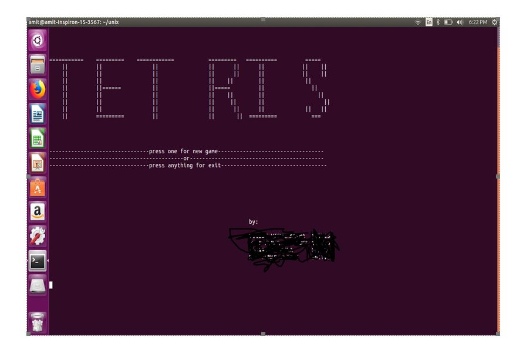
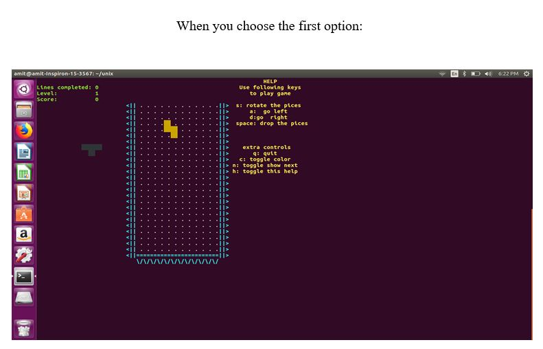
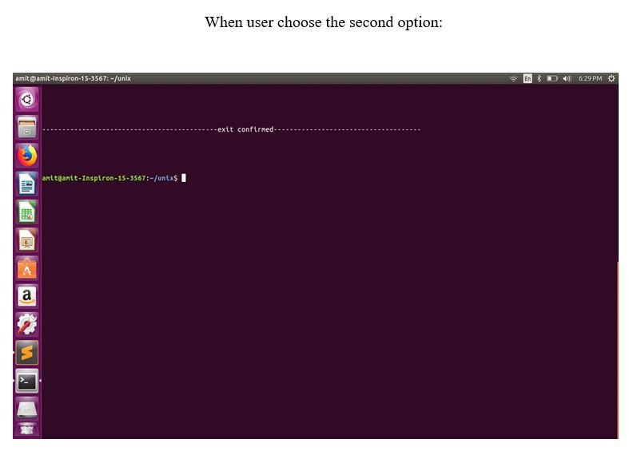
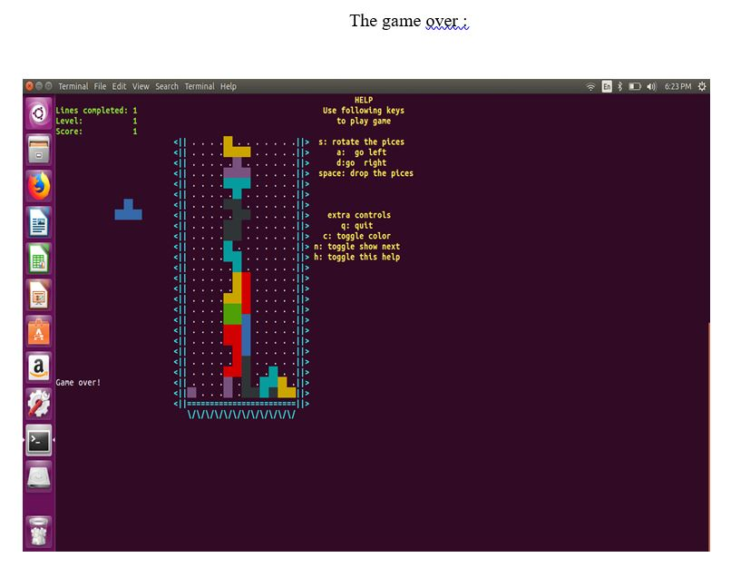

# tetris-game
tetris game using pure bash
We use a 1-D array to store the cells in a horizontal manner, and strings with pre-computed rotations to store the various pieces.
The Tetris pieces and their default rotations are generated using a random generation function.
There are separate forked processes for checking input, running and escaping/delaying the game.
Several functions for implementing tasks like checking for permissible locations, completed lines, or updating the playfield using (nested) loops where required.
Use of appropriate color has been done throughout the program.

List of some UNIX commands used in this project:

•	stty (For saving terminal state)
•	pkill(For sending signals)
•	awk(For processing data)
•	RANDOM(For generating random numbers)
•	trap(For performing actions on the signals)
Tetris is a tile-matching puzzle video game, originally designed and programmed by Russian game designer Alexey Pajitnov.

